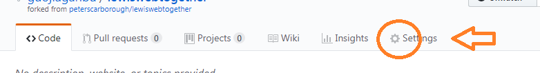
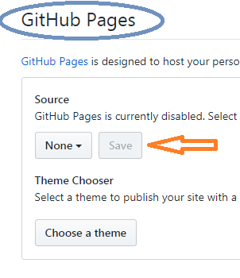
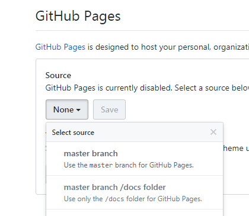
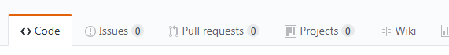
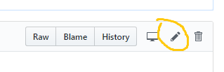

 **1. fork this repository**
 sign in github
 go to:
https://github.com/peterscarborough/lewiswebtogether

 see the screen shot below, and click fork.

  **2. setup github pages**
click settings and go to github pages area, see screen shot:

github pages area:

select master branch here.

Once finish, go to 

https://{{your-user-id}}.github.io/lewiswebtogether/.

and you should be able to see your work.  It is a copy of this page. 
Once you point your domain to here, you have a new website.

**3.notice wiki issues buttons**
these are good things, very useful for collaboration. But not for web pages visitors. Only for editors.

**4.make some changes**
click the file you want to change and click button in the screen shot.

**5.other resouces:**
you can google keywords

"how to use github pages to build a website"

one of results, a simple instruction.
https://dev.to/programliftoff/create-your-first-website-on-github-pages

**6. online wysiwyg editors**
you can try some online wysiwyg editors, for exaample this one:

StackEdit – In-browser Markdown editor
https://stackedit.io/

**next

come back here 
https://github.com/peterscarborough/lewiswebtogether

and I will add other topics like how to sync with gitbook.com later.
**
